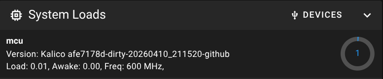
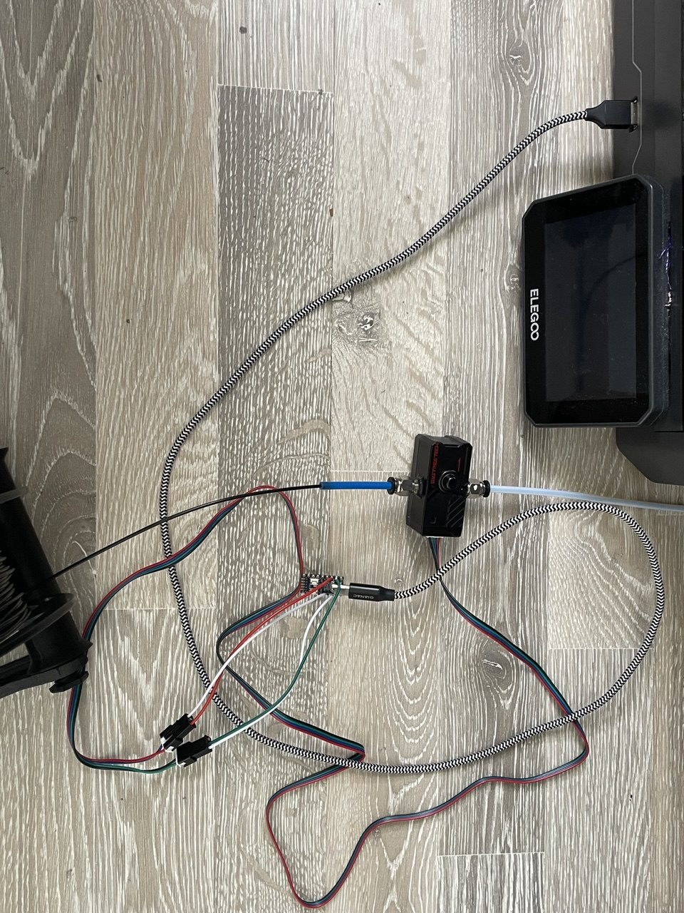
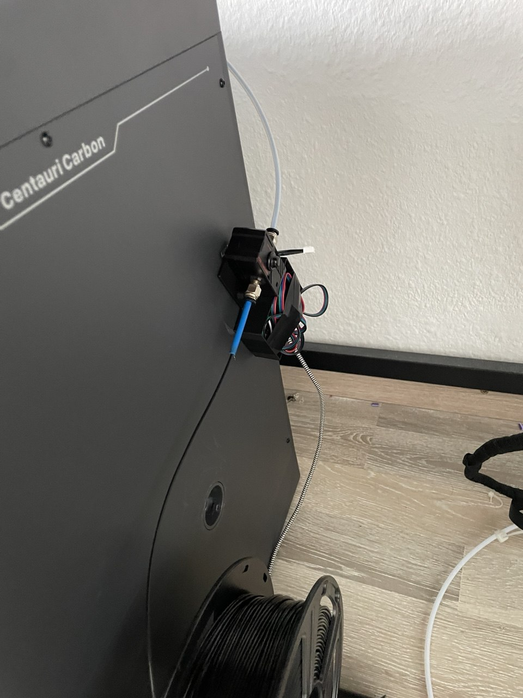

# How use BTT SFS v2 on Centauri Carbon with Cosmos and external USB MCU

Goal of this project is it to use the BTT SFS v2 or any other filament motion / switch sensor with the centauri carbon 1. It is done using a RP2040 as a MCU and connecting the sensor to it. Other sensors can be connected in a similar fashion to the centauri.

## 0. BOM

 - BTT SFS v2
 - RP2040-Zero (Refered to as RPi rest of the guide)
 - Centauri Carbon running Cosmos (at time of wrting beta 0.4)
 - USB-A to USB-C data supporting wire
 - Soldering equipment

## 1. Flash RPi 

First we will flash the external MCU that we use for connecting external sensors (No need to touch the motherboard).
This requires the same klipper/kalico version as running on the printer. You _MUST_ check what commit version you are on.
This is done the easiest via mainsail.

.

Then we can prepare the firmware


```bash
git clone https://github.com/OpenCentauri/kalico.git && cd kalico
git checkout afe7178d # Check branch via mainsail ui
make menuconfig
```

In the menuconfig choose the following options if you use a RPi Pico too:
```
Micro-controller Architecture
---> RP2040/RP235x
Connunication Interface
---> USBSERIAL
```

Then build it:
```make -j$(nproc)```

Lastly copy `out/klipper.uf2` via USB onto the RPi.

## 2. Wireing

Now we have to solder the SFS connections to our RPi.
I used the following Pins:
|Wire SFS             |GPIO RPi|
|---------------------|--------|
|Red (VCC)            |3V3     |
|Black (GND)          |GND     |
|Green (Motion Sensor)|GP2     |
|Blue (Switch Sensor) |GP3     |

Please check your port what pins are mapped to what GPIO (e.g. GP2 -> Pin 2, GP3 -> Pin 3, but it could sadly vary). 

I recommend wiring two female JST 3pin connectors. They fit to the cable that was included in my sfs.

Finally connact the RPi to the SFS and the Pico via USB to the front port of the Centauri.



## klipper

SSH into the printer and run `ls /dev/serial/by-id`:
```
root@elegoo-centauri-carbon1: ls /dev/serial/by-id/
usb-Klipper_rp2040_5054316568A22D1C-if00               usb-Klipper_stm32f401xc_3A0041000151343430363533-if00
```

We will need to use the serial interface of the Pi you can identify by the `rp2024`.

Now add this to your `printer.cfg` and change the serial-id to your RPi:
```TOML
[mcu pico]
serial: /dev/serial/by-id/usb-Klipper_rp2040_5054316568A22D1C-if00
is_non_critical: True
```

Then you can add the runout sensor config:
```TOML
[filament_motion_sensor sfs_pico]
switch_pin: pico:gpio2
detection_length: 7.0 # Potential to be tuned
extruder: extruder
pause_on_runout: True

[filament_switch_sensor runout_pico]
switch_pin: pico:gpio3
pause_on_runout: True
```

## 3. Final words

I would recommend to test it manual by holding the filament, letting it run out on purpose before you depend on it working.

Currently I do not have custom enclose and just used [this one from jrowny](https://makerworld.com/en/models/1594174-carbon-centauri-x-bigtreetech-sfs-2-0-mod#profileId-1679312)

Final pic less messy, but still room for improvement:

